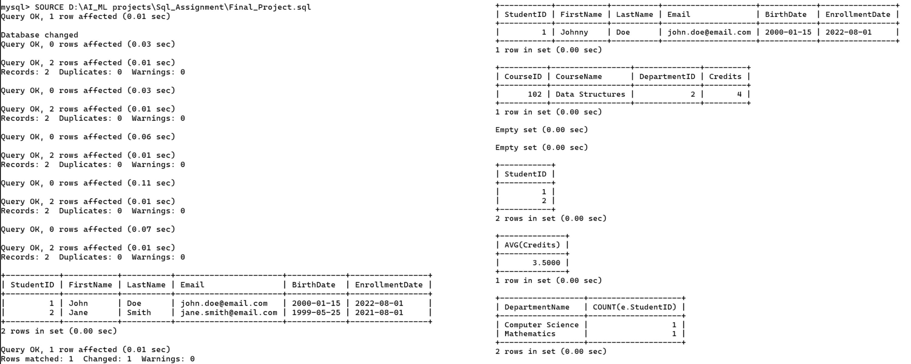

# 🚀 SQL Final Project Analyzer

A beginner-friendly SQL project focused on database management, query analysis, and reporting techniques using real-world academic data.

## 📌 About This Project
This repository contains:
- Database creation and management
- Table creation and relationships
- SQL query execution
- Data filtering and aggregation
- JOIN operations
- Reporting and analysis techniques
- Beginner-friendly database exercises

## 📂 Files Included
- `Final_Project.sql` → SQL file containing complete database operations and analysis queries
- `Final_Project_Output.png` → Output screenshot of SQL query execution

## 🛠 Technologies Used
- SQL
- MySQL

## 🎯 Learning Goals
This project helps in understanding:
- Database management concepts
- SQL query execution
- JOIN and aggregation techniques
- Reporting and analysis
- Real-world database workflow

## 📸 Project Output

## 👨‍💻 Author
**Yashraj Sharma**

---
⭐ If you like this project, don't forget to star the repository.
